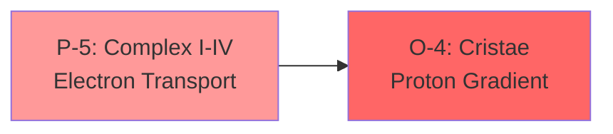
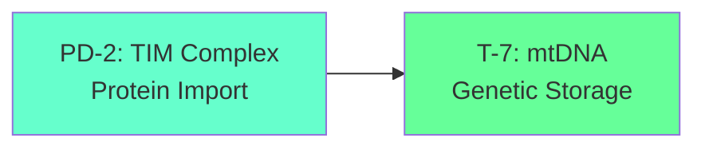
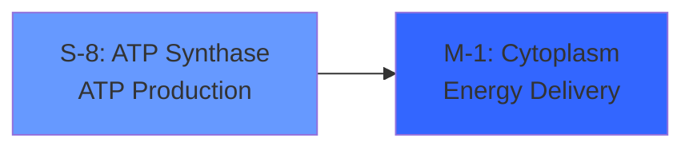
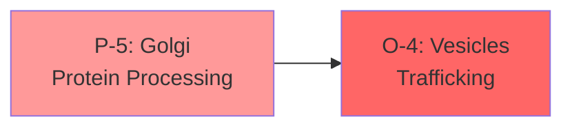
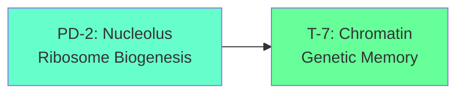
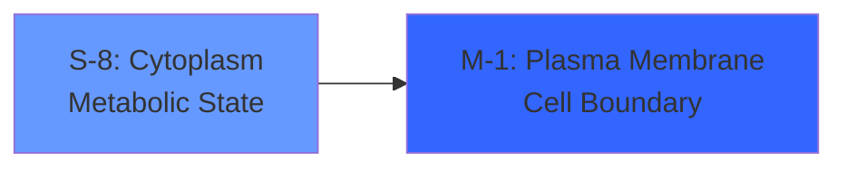

# cosys-cell

## Cosmos System Model Applied to Eukaryotic Cell, Organelles & Detailed Mitochondria with Double Membrane

This repository implements the **Cosmos System 5** triadic architecture mapped to cellular biology, providing a comprehensive framework for understanding and modeling eukaryotic cells, organelles, and the detailed structure of mitochondria through organizational systems theory.

---

## Overview

**cosys-cell** translates the Cosmos System's triadic polarity structure into a cellular model that treats the eukaryotic cell as a self-organizing cognitive system. The framework implements the **18-service [[D-T]-[P-O]-[S-M]] pattern** mapped to cellular compartments, organelle functions, and membrane dynamics.

### Core Mapping: Cell as Cognitive Triad

```
┌─────────────────────────────────────────────────────────────────────────────┐
│                    COSYS-CELL: CELLULAR COSMOS SYSTEM                       │
├─────────────────────────────────────────────────────────────────────────────┤
│                                                                             │
│   ┌─────────────────────────────────────────────────────────────────────┐   │
│   │                    CEREBRAL TRIAD [3]                               │   │
│   │                    Nucleus - Genetic Control Center                 │   │
│   │                    Potential Topology                               │   │
│   ├─────────────────────────────────────────────────────────────────────┤   │
│   │  T-7: Chromatin             │  PD-2: Nucleolus                     │   │
│   │  Genetic Treasury           │  Ribosome Development                │   │
│   │  DNA Storage                │  rRNA Synthesis                      │   │
│   ├────────────────────────────┼────────────────────────────────────────┤   │
│   │  P-5: Transcription         │  O-4: Nuclear Envelope               │   │
│   │  mRNA Production            │  Nuclear Organization                │   │
│   │  Gene Expression            │  Nuclear Pore Complex                │   │
│   └─────────────────────────────────────────────────────────────────────┘   │
│                                    │                                        │
│                                    ▼                                        │
│   ┌─────────────────────────────────────────────────────────────────────┐   │
│   │                    SOMATIC TRIAD [6]                                │   │
│   │                    Endomembrane System - Protein Processing         │   │
│   │                    Commitment Topology                              │   │
│   ├─────────────────────────────────────────────────────────────────────┤   │
│   │  M-1: Plasma Membrane       │  S-8: Endoplasmic Reticulum          │   │
│   │  Cell Boundary              │  Protein Synthesis State             │   │
│   │  Signal Reception           │  Lipid Production                    │   │
│   ├────────────────────────────┼────────────────────────────────────────┤   │
│   │  P-5: Golgi Apparatus       │  O-4: Vesicle Transport              │   │
│   │  Protein Processing         │  Secretory Organization              │   │
│   │  Glycosylation              │  Trafficking Routes                  │   │
│   └─────────────────────────────────────────────────────────────────────┘   │
│                                    │                                        │
│                                    ▼                                        │
│   ┌─────────────────────────────────────────────────────────────────────┐   │
│   │                    AUTONOMIC TRIAD [9]                              │   │
│   │                    Energy & Homeostasis - Metabolic Regulation      │   │
│   │                    Performance Topology                             │   │
│   ├─────────────────────────────────────────────────────────────────────┤   │
│   │  M-1: Mitochondria          │  S-8: Cytoplasm                      │   │
│   │  Energy Monitoring          │  Metabolic State                     │   │
│   │  ATP Production             │  Ion Homeostasis                     │   │
│   ├────────────────────────────┼────────────────────────────────────────┤   │
│   │  PD-2: Peroxisomes          │  T-7: Lysosomes                      │   │
│   │  Oxidative Processing       │  Degradation Triggers                │   │
│   │  Detoxification             │  Autophagy Initiation                │   │
│   ├────────────────────────────┼────────────────────────────────────────┤   │
│   │  P-5: Cytoskeleton          │                                      │   │
│   │  Structural Processing      │                                      │   │
│   │  Intracellular Transport    │                                      │   │
│   └─────────────────────────────────────────────────────────────────────┘   │
│                                                                             │
└─────────────────────────────────────────────────────────────────────────────┘
```

---

## Theoretical Foundation

### The Cell as Self-Organizing System

Based on Eric Schwarz's Holistic Metamodel, the eukaryotic cell exhibits all characteristics of a **self-organizing cognitive system**:

#### The Hieroglyphic Monad (Cellular Identity)
The cell's **genome** serves as the hieroglyphic monad—the unity principle that manifests at all levels:
- **Level 0**: Complete genome (DNA)
- **Level 1**: Expressed genes (transcriptome)
- **Level 2**: Protein products (proteome)
- **Level 3**: Metabolic state (metabolome)
- **Level 4**: Phenotypic behavior

#### Dual Complementarity (Anabolic-Catabolic)
| Anabolic (Building) | Catabolic (Breaking) | Resolution |
|---------------------|---------------------|------------|
| Protein synthesis | Protein degradation | Proteostasis |
| DNA replication | DNA repair | Genome maintenance |
| Lipid synthesis | Lipid oxidation | Membrane homeostasis |
| ATP production | ATP consumption | Energy balance |

#### Triadic System (Structure-Function-Regulation)
| Primitive | Cellular Manifestation |
|-----------|------------------------|
| **Being** | Cellular structure, organelles, macromolecules |
| **Becoming** | Metabolism, growth, division, differentiation |
| **Relation** | Signaling, communication, environmental response |

---

## The 18-Service [[D-T]-[P-O]-[S-M]] Pattern for Cells

### Complete Cellular Service Mapping

```
                    D-T         P-O         S-M         Total
Cerebral (Nucleus)  2           2           2           = 6
Somatic (Endomem)   2*          2           2           = 6  
Autonomic (Energy)  2*          2           2           = 6
                    ────────────────────────────────────────
Total:              6           6           6           = 18

*Parasympathetic Polarity [D-T] shared between Somatic and Autonomic
```

### Cerebral Triad Services (Nucleus)

| Service | Code | Organelle/Structure | Cellular Function |
|---------|------|---------------------|-------------------|
| **Development** | PD-2 | Nucleolus | Ribosome biogenesis, rRNA synthesis |
| **Treasury** | T-7 | Chromatin | DNA storage, genetic memory |
| **Production** | P-5 | Transcription machinery | mRNA production, gene expression |
| **Organization** | O-4 | Nuclear envelope | Nuclear organization, pore complexes |
| **Sales** | S-8 | mRNA export | Transcript delivery to cytoplasm |
| **Market** | M-1 | Nuclear import | Transcription factor reception |

### Somatic Triad Services (Endomembrane System)

| Service | Code | Organelle/Structure | Cellular Function |
|---------|------|---------------------|-------------------|
| **Development** | PD-2 | Rough ER* | Protein folding development |
| **Treasury** | T-7 | Smooth ER* | Lipid storage, calcium reservoir |
| **Production** | P-5 | Golgi apparatus | Protein processing, glycosylation |
| **Organization** | O-4 | Vesicle transport | Secretory pathway organization |
| **Sales** | S-8 | Endoplasmic Reticulum | Protein synthesis state |
| **Market** | M-1 | Plasma membrane | Cell boundary, signal reception |

### Autonomic Triad Services (Energy & Homeostasis)

| Service | Code | Organelle/Structure | Cellular Function |
|---------|------|---------------------|-------------------|
| **Development** | PD-2 | Peroxisomes* | Oxidative processing, detox |
| **Treasury** | T-7 | Lysosomes | Degradation triggers, autophagy |
| **Production** | P-5 | Cytoskeleton | Structural support, transport |
| **Organization** | O-4 | Centrosome | Microtubule organization |
| **Sales** | S-8 | Cytoplasm | Metabolic state, ion homeostasis |
| **Market** | M-1 | Mitochondria | Energy monitoring, ATP production |

---

## Mitochondria: The Double Membrane System

### Mitochondria as Nested Triadic System

The mitochondrion exemplifies the **nested triadic architecture** with its double membrane structure:

```
┌─────────────────────────────────────────────────────────────────────────────┐
│                    MITOCHONDRIA: DOUBLE MEMBRANE COSMOS                     │
├─────────────────────────────────────────────────────────────────────────────┤
│                                                                             │
│   ┌─────────────────────────────────────────────────────────────────────┐   │
│   │                    OUTER MEMBRANE TRIAD                             │   │
│   │                    Boundary & Transport Functions                   │   │
│   ├─────────────────────────────────────────────────────────────────────┤   │
│   │  T-7: Porins                │  PD-2: TOM Complex                   │   │
│   │  Small Molecule Treasury    │  Protein Import Development          │   │
│   │  Metabolite Exchange        │  Preprotein Recognition              │   │
│   ├────────────────────────────┼────────────────────────────────────────┤   │
│   │  P-5: VDAC Channels         │  O-4: Outer Membrane Org             │   │
│   │  Voltage Processing         │  Membrane Dynamics                   │   │
│   │  Ion/Metabolite Flow        │  Fusion/Fission Control              │   │
│   └─────────────────────────────────────────────────────────────────────┘   │
│                                    │                                        │
│                                    ▼                                        │
│   ┌─────────────────────────────────────────────────────────────────────┐   │
│   │                    INTERMEMBRANE SPACE TRIAD                        │   │
│   │                    Electron Shuttle & Signaling                     │   │
│   ├─────────────────────────────────────────────────────────────────────┤   │
│   │  M-1: Cytochrome c          │  S-8: Proton Gradient                │   │
│   │  Electron Carrier           │  Electrochemical State               │   │
│   │  Apoptosis Signal           │  ΔΨ Maintenance                      │   │
│   ├────────────────────────────┼────────────────────────────────────────┤   │
│   │  P-5: Electron Transport    │  O-4: IMS Organization               │   │
│   │  Redox Processing           │  Protein Sorting                     │   │
│   │  Complex III/IV Interface   │  MIA Pathway                         │   │
│   └─────────────────────────────────────────────────────────────────────┘   │
│                                    │                                        │
│                                    ▼                                        │
│   ┌─────────────────────────────────────────────────────────────────────┐   │
│   │                    INNER MEMBRANE TRIAD                             │   │
│   │                    Oxidative Phosphorylation Core                   │   │
│   ├─────────────────────────────────────────────────────────────────────┤   │
│   │  M-1: Complex I-IV          │  S-8: ATP Synthase                   │   │
│   │  Electron Transport         │  ATP State Management                │   │
│   │  Proton Pumping             │  Rotary Motor                        │   │
│   ├────────────────────────────┼────────────────────────────────────────┤   │
│   │  PD-2: TIM Complex          │  T-7: Cristae                        │   │
│   │  Matrix Import              │  Surface Area Treasury               │   │
│   │  Protein Translocation      │  ETC Localization                    │   │
│   ├────────────────────────────┼────────────────────────────────────────┤   │
│   │  P-5: Carrier Proteins      │                                      │   │
│   │  Metabolite Transport       │                                      │   │
│   │  ADP/ATP Exchange           │                                      │   │
│   └─────────────────────────────────────────────────────────────────────┘   │
│                                    │                                        │
│                                    ▼                                        │
│   ┌─────────────────────────────────────────────────────────────────────┐   │
│   │                    MATRIX TRIAD                                     │   │
│   │                    Metabolic Core & mtDNA                           │   │
│   ├─────────────────────────────────────────────────────────────────────┤   │
│   │  T-7: mtDNA                 │  PD-2: Mitochondrial Ribosomes       │   │
│   │  Genetic Treasury           │  Protein Synthesis                   │   │
│   │  13 ETC Subunits            │  Local Translation                   │   │
│   ├────────────────────────────┼────────────────────────────────────────┤   │
│   │  P-5: TCA Cycle Enzymes     │  O-4: Matrix Organization            │   │
│   │  Metabolic Processing       │  Enzyme Complexes                    │   │
│   │  NADH/FADH2 Production      │  Metabolon Assembly                  │   │
│   └─────────────────────────────────────────────────────────────────────┘   │
│                                                                             │
└─────────────────────────────────────────────────────────────────────────────┘
```

### Mitochondrial Electron Transport Chain as Dimensional Flow

#### Commitment Dimension [5-4]: Electron Processing → Organization
**ETC Flow**: Electron Transfer → Proton Pumping Organization



#### Potential Dimension [2-7]: Import → Storage
**Matrix Flow**: Protein Import → Genetic Treasury



#### Performance Dimension [8-1]: ATP State → Energy Output
**Energy Flow**: ATP Synthase → Cellular Energy



---

## System 5 Cellular State Machine

### The 60-Step Cell Cycle

The cell operates on a **60-step deterministic cycle** (LCM of 3 and 20) representing the synchronization of nuclear and cytoplasmic processes:

```python
class CellularSystem5:
    """
    Implements the 60-step cellular cycle with triadic dynamics.
    """
    
    def __init__(self):
        # Universal Sets: Cell Cycle Phases
        self.U1 = G1Phase()          # Growth phase 1
        self.U2 = SPhase()           # DNA synthesis
        self.U3 = G2M_Phase()        # Growth 2 + Mitosis
        
        # Particular Sets: Cellular Compartments
        self.P1 = Nucleus()          # Genetic control
        self.P2 = EndomembraneSystem()  # Protein processing
        self.P3 = Mitochondria()     # Energy production
        self.P4 = Cytoskeleton()     # Structure & transport
        
    def cell_cycle_step(self, t: int):
        """Execute one step of the 60-step cell cycle."""
        # Universal phase transition (3-step cycle)
        u_idx = t % 3
        phase = self.get_phase(u_idx)
        
        # Particular compartment transition (5-step staggered)
        p_idx = t % 5
        if p_idx < 4:
            compartment = [self.P1, self.P2, self.P3, self.P4][p_idx]
            return compartment.process(phase)
        
        # Rest step: checkpoint
        return self.checkpoint_evaluation()
```

### Nested Concurrency in Cellular Processes

The **convolution of concurrency** implements parallel organelle processing:

$$S_{organelle}(t+1) = (S_{organelle}(t) + \sum_{other} S_{other}(t) + Phase_{cell}(t)) \mod 4$$

This captures cellular interdependencies where:
- Nucleus affects ER protein synthesis
- ER affects Golgi processing
- Mitochondria affect all energy-dependent processes
- Cytoskeleton affects all transport

---

## Dimensional Flow Architecture

### Commitment Dimension [5-4]: Production → Organization
**Cellular Flow**: Biosynthesis → Structural Organization



**Characteristics**:
- Protein modification to secretion
- Lipid synthesis to membrane assembly
- Commitment to cellular output
- Quality control integration

### Potential Dimension [2-7]: Development → Treasury
**Cellular Flow**: Biogenesis → Storage



**Characteristics**:
- Ribosome assembly to protein potential
- Gene expression to epigenetic memory
- Potential information storage
- Developmental programming

### Performance Dimension [8-1]: State → Interface
**Cellular Flow**: Metabolic State → Environmental Interface



**Characteristics**:
- Metabolic sensing to signal transduction
- Ion homeostasis to membrane potential
- Performance optimization cycle
- Environmental responsiveness

---

## Cellular Autognosis

### Self-Aware Cell System

The cell implements **hierarchical self-monitoring** through:

#### Self-Monitoring Layer
- **Metabolic Sensors**: AMPK, mTOR, sirtuins
- **DNA Damage Response**: ATM, ATR, p53
- **Protein Quality Control**: Unfolded protein response
- **Redox Sensors**: Nrf2, HIF-1α

#### Self-Modeling Layer
- **Transcriptome Analysis**: Gene expression patterns
- **Proteome State**: Protein abundance and modifications
- **Metabolome Profile**: Metabolite concentrations
- **Epigenome Status**: Chromatin state

#### Meta-Cognitive Layer
- **Cell Fate Decisions**: Proliferation vs. differentiation
- **Stress Response Integration**: Multiple pathway coordination
- **Apoptosis Assessment**: Death vs. survival decisions
- **Senescence Evaluation**: Aging markers

#### Self-Optimization Layer
- **Autophagy**: Self-eating for renewal
- **Mitophagy**: Mitochondrial quality control
- **Proteostasis**: Protein homeostasis maintenance
- **Metabolic Reprogramming**: Energy optimization

```python
class CellularAutognosis:
    """
    Self-awareness system for eukaryotic cells.
    """
    
    def __init__(self, cell: CellularSystem5):
        self.cell = cell
        self.sensor_network = SensorNetwork()
        
    def monitor(self) -> Dict[str, float]:
        """Monitor cellular health metrics."""
        return {
            'atp_level': self.sensor_network.measure_atp(),
            'ros_level': self.sensor_network.measure_ros(),
            'dna_damage': self.sensor_network.measure_dna_damage(),
            'protein_stress': self.sensor_network.measure_upr(),
            'nutrient_status': self.sensor_network.measure_nutrients(),
            'membrane_potential': self.sensor_network.measure_delta_psi(),
        }
        
    def assess_fate(self) -> str:
        """Determine cell fate based on current state."""
        metrics = self.monitor()
        
        if metrics['dna_damage'] > 0.8:
            return 'APOPTOSIS'
        elif metrics['atp_level'] < 0.2:
            return 'NECROSIS'
        elif metrics['nutrient_status'] < 0.3:
            return 'AUTOPHAGY'
        elif metrics['protein_stress'] > 0.7:
            return 'SENESCENCE'
        else:
            return 'PROLIFERATION'
```

---

## Cellular Ontogenesis

### Self-Generating Cellular Programs

Cells evolve through **self-generating kernels** that create new capabilities:

```python
class CellularGenome:
    """
    Evolutionary genome for cellular programs.
    """
    
    def __init__(self):
        self.genes = {
            'metabolic_rate': FloatGene(0.5, 2.0),
            'proliferation_rate': FloatGene(0.1, 1.0),
            'stress_resistance': FloatGene(0.3, 0.9),
            'differentiation_potential': FloatGene(0.0, 1.0),
            'migration_capacity': FloatGene(0.0, 1.0),
            'secretory_activity': FloatGene(0.2, 0.8),
        }
        self.fitness = 0.0
        self.generation = 0
        
    def express(self, environment: Environment) -> Phenotype:
        """Express genome in given environment."""
        expression_levels = {}
        for gene_name, gene in self.genes.items():
            # Environment-dependent expression
            expression_levels[gene_name] = gene.express(environment)
        return Phenotype(expression_levels)
```

### Cellular Differentiation as Kernel Evolution

```python
def cellular_differentiation(stem_cell: CellularGenome, 
                            signals: List[Signal],
                            generations: int) -> List[CellularGenome]:
    """
    Evolve stem cell through differentiation signals.
    """
    population = [stem_cell]
    
    for gen in range(generations):
        # Apply differentiation signals
        for signal in signals:
            for cell in population:
                cell.apply_signal(signal)
                
        # Evaluate fitness in tissue context
        fitness_scores = [evaluate_tissue_fitness(cell) for cell in population]
        
        # Selection based on tissue needs
        selected = tissue_selection(population, fitness_scores)
        
        # Asymmetric division (stem cell maintenance)
        offspring = asymmetric_division(selected)
        
        population = offspring
        
    return population
```

---

## Implementation

### Directory Structure
```
cosys-cell/
├── README.md
├── ARCHITECTURE.md
├── MITOCHONDRIA.md
├── src/
│   ├── cerebral-triad/
│   │   ├── chromatin-service/        # T-7: DNA storage
│   │   ├── nucleolus-service/        # PD-2: Ribosome biogenesis
│   │   ├── transcription-service/    # P-5: mRNA production
│   │   └── nuclear-envelope/         # O-4: Nuclear organization
│   ├── somatic-triad/
│   │   ├── plasma-membrane/          # M-1: Cell boundary
│   │   ├── endoplasmic-reticulum/    # S-8: Protein synthesis
│   │   ├── golgi-apparatus/          # P-5: Protein processing
│   │   └── vesicle-transport/        # O-4: Secretory pathway
│   ├── autonomic-triad/
│   │   ├── mitochondria/             # M-1: Energy production
│   │   │   ├── outer-membrane/
│   │   │   ├── intermembrane-space/
│   │   │   ├── inner-membrane/
│   │   │   └── matrix/
│   │   ├── cytoplasm/                # S-8: Metabolic state
│   │   ├── peroxisomes/              # PD-2: Oxidative processing
│   │   ├── lysosomes/                # T-7: Degradation
│   │   └── cytoskeleton/             # P-5: Structure
│   ├── cellular-core/
│   │   ├── autognosis/               # Self-awareness
│   │   ├── ontogenesis/              # Differentiation
│   │   ├── cell-cycle/               # Division control
│   │   └── signaling/                # Signal transduction
│   └── integration-hub/
│       ├── metabolic-network/        # Metabolic integration
│       ├── event-bus/                # Signaling cascades
│       └── shared-libraries/         # Common utilities
├── models/
│   ├── system5-cell.py               # 60-step state machine
│   ├── mitochondria.py               # Double membrane model
│   └── polarity-cell.py              # 18-service mapping
└── docs/
    ├── cell-biology.md
    ├── mitochondria-detail.md
    └── implementation-guide.md
```

### Core Implementation

#### Eukaryotic Cell Core
```python
import numpy as np
from typing import Dict, List

class EukaryoticCell:
    """
    Cosmos System 5 Eukaryotic Cell implementation.
    """
    
    def __init__(self):
        # Cerebral Triad: Nucleus
        self.nucleus = Nucleus()
        
        # Somatic Triad: Endomembrane System
        self.plasma_membrane = PlasmaMembrane()
        self.endoplasmic_reticulum = EndoplasmicReticulum()
        self.golgi_apparatus = GolgiApparatus()
        self.vesicles = VesicleSystem()
        
        # Autonomic Triad: Energy & Homeostasis
        self.mitochondria = Mitochondria()
        self.cytoplasm = Cytoplasm()
        self.peroxisomes = Peroxisomes()
        self.lysosomes = Lysosomes()
        self.cytoskeleton = Cytoskeleton()
        
        # Cell state
        self.cell_cycle_phase = 'G1'
        self.metabolic_state = MetabolicState()
        
    def process_signal(self, signal: Signal) -> Response:
        """
        Process extracellular signal through cellular machinery.
        """
        # M-1: Plasma membrane receives signal
        receptor_activation = self.plasma_membrane.receive(signal)
        
        # Signal transduction cascade
        second_messengers = self.transduce_signal(receptor_activation)
        
        # Nuclear response (Cerebral Triad)
        if signal.requires_transcription:
            gene_expression = self.nucleus.respond(second_messengers)
            
            # S-8: ER protein synthesis
            proteins = self.endoplasmic_reticulum.synthesize(gene_expression)
            
            # P-5: Golgi processing
            processed_proteins = self.golgi_apparatus.process(proteins)
            
            # O-4: Vesicle transport
            self.vesicles.deliver(processed_proteins)
            
        return Response(processed_proteins)
        
    def metabolize(self, nutrients: Nutrients) -> Energy:
        """
        Process nutrients through metabolic pathways.
        """
        # Cytoplasmic glycolysis
        pyruvate = self.cytoplasm.glycolysis(nutrients.glucose)
        
        # Mitochondrial oxidation
        atp = self.mitochondria.oxidative_phosphorylation(pyruvate)
        
        # Update metabolic state
        self.metabolic_state.update(atp)
        
        return Energy(atp)
```

#### Mitochondria Double Membrane Model
```python
class Mitochondria:
    """
    Double membrane mitochondria with nested triadic structure.
    """
    
    def __init__(self):
        # Outer Membrane Triad
        self.outer_membrane = OuterMembrane()
        
        # Intermembrane Space Triad
        self.intermembrane_space = IntermembraneSpace()
        
        # Inner Membrane Triad
        self.inner_membrane = InnerMembrane()
        
        # Matrix Triad
        self.matrix = MitochondrialMatrix()
        
        # State variables
        self.delta_psi = 0.0  # Membrane potential
        self.atp_level = 0.0
        self.nad_ratio = 0.0  # NAD+/NADH ratio
        
    def oxidative_phosphorylation(self, pyruvate: float) -> float:
        """
        Execute oxidative phosphorylation through nested triads.
        """
        # Matrix: TCA cycle
        nadh, fadh2 = self.matrix.tca_cycle(pyruvate)
        
        # Inner Membrane: Electron transport chain
        protons_pumped = self.inner_membrane.electron_transport(nadh, fadh2)
        
        # Intermembrane Space: Proton gradient
        self.delta_psi = self.intermembrane_space.maintain_gradient(protons_pumped)
        
        # Inner Membrane: ATP synthesis
        atp = self.inner_membrane.atp_synthase(self.delta_psi)
        
        # Outer Membrane: ATP export
        exported_atp = self.outer_membrane.export_atp(atp)
        
        self.atp_level = exported_atp
        return exported_atp
        
    def import_protein(self, preprotein: Preprotein) -> MitochondrialProtein:
        """
        Import nuclear-encoded protein through TOM/TIM complexes.
        """
        # Outer Membrane: TOM complex recognition
        recognized = self.outer_membrane.tom_complex.recognize(preprotein)
        
        # Outer Membrane: Translocation
        translocated = self.outer_membrane.tom_complex.translocate(recognized)
        
        # Intermembrane Space: Sorting
        sorted_protein = self.intermembrane_space.sort(translocated)
        
        if sorted_protein.destination == 'matrix':
            # Inner Membrane: TIM23 complex
            imported = self.inner_membrane.tim23_complex.import_protein(sorted_protein)
            
            # Matrix: Folding and assembly
            folded = self.matrix.fold_protein(imported)
            return folded
            
        elif sorted_protein.destination == 'inner_membrane':
            # Inner Membrane: TIM22 complex for carriers
            inserted = self.inner_membrane.tim22_complex.insert(sorted_protein)
            return inserted
```

---

## Usage

### Basic Cell Simulation
```python
from cosys_cell import EukaryoticCell, Signal, Nutrients

# Initialize cell
cell = EukaryoticCell()

# Process growth signal
growth_signal = Signal(type='growth_factor', intensity=0.8)
response = cell.process_signal(growth_signal)

# Metabolize nutrients
nutrients = Nutrients(glucose=5.0, fatty_acids=1.0, amino_acids=2.0)
energy = cell.metabolize(nutrients)

print(f"ATP produced: {energy.atp}")
print(f"Cell cycle phase: {cell.cell_cycle_phase}")
```

### Mitochondrial Analysis
```python
from cosys_cell import Mitochondria

# Initialize mitochondria
mito = Mitochondria()

# Run oxidative phosphorylation
pyruvate = 2.0  # mM
atp = mito.oxidative_phosphorylation(pyruvate)

# Check membrane potential
print(f"Membrane potential (ΔΨ): {mito.delta_psi} mV")
print(f"ATP level: {mito.atp_level} mM")
print(f"NAD+/NADH ratio: {mito.nad_ratio}")
```

### Cellular Autognosis
```python
from cosys_cell.cellular_core import CellularAutognosis

# Initialize autognosis
autognosis = CellularAutognosis(cell)

# Monitor health
metrics = autognosis.monitor()
print(f"ATP level: {metrics['atp_level']}")
print(f"ROS level: {metrics['ros_level']}")
print(f"DNA damage: {metrics['dna_damage']}")

# Assess cell fate
fate = autognosis.assess_fate()
print(f"Predicted cell fate: {fate}")
```

---

## References

- Alberts, B., et al. (2015). Molecular Biology of the Cell
- Schwarz, E. (1997). Toward a Holistic Cybernetics
- Nicholls, D.G., & Ferguson, S.J. (2013). Bioenergetics
- Henze, K., & Martin, W. (2003). Evolutionary biology: essence of mitochondria
- Kroemer, G., et al. (2007). Mitochondrial membrane permeabilization in cell death

---

## License

MIT License - See [LICENSE](LICENSE) for details.

---

**cosys-cell**: Where the Cosmos System meets cell biology, creating a unified framework for understanding eukaryotic cells as self-organizing cognitive systems through triadic organizational dynamics.
